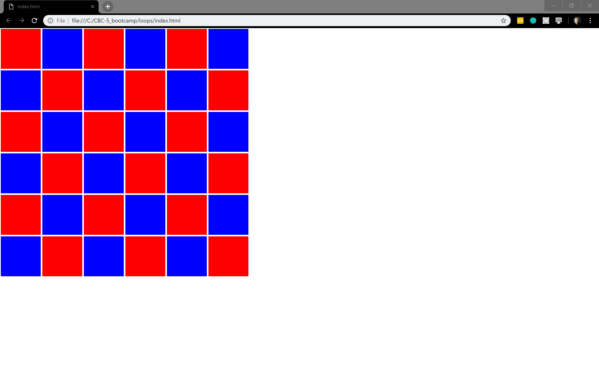

# js_checkerboard
Cool little grid generator using just html, css, and js. 

# Parameters

You can clone the solution. Then go to js/main.js. Lines 1-14 can be modified to change the grid size, color, and square shape. Please feel free to use this for a fun js game or modify for a project!
